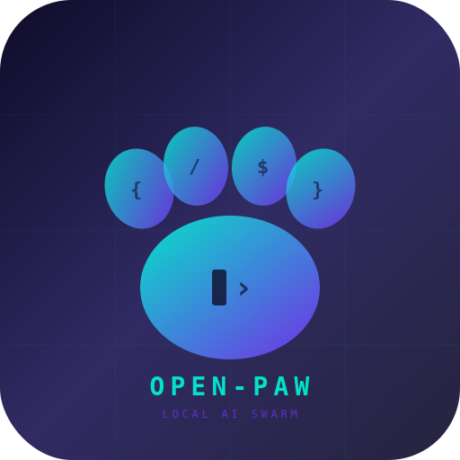
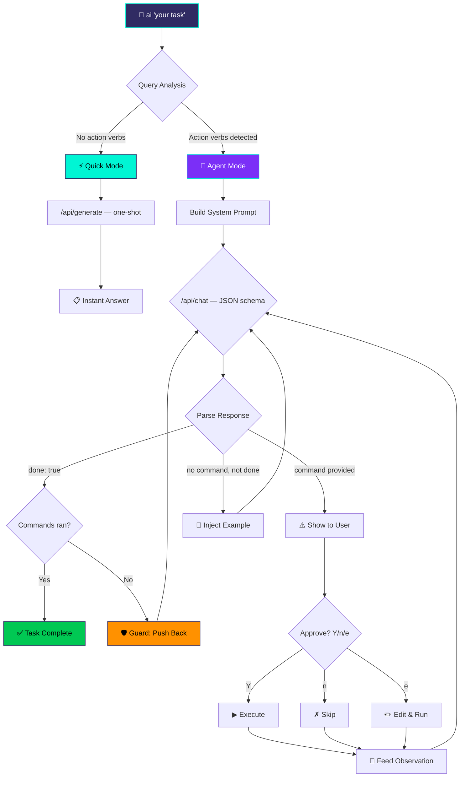

<p align="center">
  
</p>

<h1 align="center">Open-Paw</h1>

<p align="center">
  <strong>A 100% local, dual-mode AI agent for Linux terminals.</strong><br/>
  Fast for the simple. Powerful for the complex.
</p>

<p align="center">
  
  
  
  
  
</p>

---

## What is Open-Paw?

Open-Paw is a Bash-native AI CLI daemon that talks to local LLMs via [Ollama](https://ollama.com). It has two modes:

- **Quick Mode** — Real-time streaming answers for questions. Tokens appear as they're generated.
- **Agent Mode** — A full ReAct (Reasoning + Acting) loop for tasks that need real commands, with human-in-the-loop approval.

No cloud. No API keys. No telemetry. Just you, your terminal, and a local model.

---

## Quick Install

```bash
curl -fsSL https://raw.githubusercontent.com/bufferring/open-paw/master/install.sh | bash
```

Or manually:

```bash
git clone https://github.com/bufferring/open-paw.git
cd open-paw
chmod +x install.sh && ./install.sh
```

### Prerequisites

| Dependency | Install |
|:---|:---|
| [Ollama](https://ollama.com) | `curl -fsSL https://ollama.com/install.sh \| sh` |
| A model | `ollama pull qwen2.5-coder:7b` |
| `jq`, `curl`, `git` | `sudo apt install jq curl git` |

---

## Usage

### Quick Mode — Questions & Knowledge

Simple queries get real-time streaming answers. No loop, no commands.

```bash
ai what is the shutdown command on linux
ai how do I check disk usage
ai --quick explain iptables rules
```

### Agent Mode — CLI Tasks

Tasks with action verbs auto-enter the ReAct agent loop. The agent proposes commands and waits for your approval.

```bash
ai create a file called notes.txt on the Desktop
ai find all .log files larger than 100MB
ai install and configure nginx
ai --agent "do whatever I say"       # Force agent mode
```

### Swarm Mode — Multi-Agent Orchestration

Spawn specialized agents with their own models and memory.

```bash
ai "create a new agent named python_dev using model llama3.2"
python_dev "write a monitoring script and schedule it with cron"
```

### Session Recovery

```bash
ai --resume
```

---

## How It Works



---

## Architecture

```text
~/.agent_workspace/
├── bin/                     # Executables (add to $PATH)
│   ├── ai                   # Default agent (symlink)
│   └── <custom_agent>       # Spawned agents (symlinks)
├── agents/
│   ├── ai/
│   │   ├── core.json        # {"model": "qwen2.5-coder:7b"}
│   │   └── skills.json      # Local memory
│   └── <custom_agent>/
├── scripts/                 # AI-generated script sandbox
├── global_skills.json       # Shared memory across all agents
├── audit.log                # Immutable JSON event ledger
└── .git/                    # Auto-initialized for rollbacks
```

---

## Feature Matrix

### Speed
| Feature | Implementation |
|:---|:---|
| **Real-Time Streaming** | Quick Mode streams tokens to terminal as they generate — no waiting for full response |
| **Model Keep-Alive** | `keep_alive: 30m` prevents model unloading between calls — eliminates cold-start latency |
| **Safe JSON Payloads** | All API payloads built via `jq` — no string interpolation breakage from special characters |
| **Temperature Tuning** | Quick: 0.3 (factual) · Agent: 0 (deterministic JSON) |
| **Token Budgets** | Quick: 512 tokens · Agent: 1024 tokens — right-sized per mode |

### Intelligence
| Feature | Implementation |
|:---|:---|
| **Directory Context** | Agent sees `ls -1A` of CWD — knows what files exist before proposing commands |
| **Installed Tools Detection** | Probes for 30+ tools (python3, docker, gcc, node, etc.) — model only suggests what's available |
| **Auto-Learn Skills** | Saves successful task→command patterns to `skills.json` — builds memory over time |
| **Smart Context Pruning** | Keeps system + task + last 8 turns (up from 6) in a single jq call |
| **Error Recovery** | On 2 consecutive JSON parse failures, trims corrupting context and retries clean |
| **9 Agent Rules** | Single-line commands, report negative findings, never repeat, only use installed tools |

### Agentic Mode Detection
| Feature | Implementation |
|:---|:---|
| **150+ Action Verb Gate** | Stem-based matching with full forms covering file ops, networking, packages, services, processes, and sysadmin |
| **Conjugation-Safe Matching** | `grep -Ei` substring match — "installing", "running", "executed" all trigger Agent Mode |
| **`--agent` Flag** | Force agent mode for any query, bypassing verb detection |
| **`--quick` Flag** | Force quick mode for any query |
| **Mandatory Command Schema** | JSON schema `required: ["thought", "command", "done"]` — model must propose a command every turn |
| **Command Sanitizer** | Strips literal newlines from model-proposed commands |
| **Duplicate Command Guard** | Detects repeated identical commands and forces a new approach |
| **Output Sanitizer** | Strips control chars, caps at 50 lines |

### Swarm Orchestration
| Feature | Implementation |
|:---|:---|
| **Multi-Agent Spawning** | `mkdir + core.json + ln -sf` |
| **Identity Assumption** | `basename "$0"` dynamic identity |
| **Explicit Delegation** | Never auto-delegates. User must command it. |
| **Model Hot-Swapping** | Edit `core.json` → `ollama pull` |

### Safety & Execution
| Feature | Implementation |
|:---|:---|
| **JSON Schema Enforcement** | Ollama `format: object` with required fields + `temperature: 0` for deterministic outputs |
| **Human-in-the-Loop** | `Y/n/e` approval before every command |
| **Sudo Pre-Auth** | Detects `sudo`, runs `sudo -v` before execution — no password prompt bleeding |
| **Smart Error Detection** | Auto-annotates permission errors and timeouts in observations |
| **Subshell Isolation** | `bash -c` instead of `eval` |
| **Execution Timeouts** | `timeout 60` on all commands with exit code detection |
| **Session Recovery** | `--resume` from `/tmp/` state files |
| **Lazy Git Commits** | Single batch commit at session end (not per-command) |
| **Audit Logging** | JSON event ledger in `audit.log` |

### Installer
| Feature | Implementation |
|:---|:---|
| **Smart Upgrade Detection** | Detects existing installation, compares versions, shows `vOLD → vNEW` transition |
| **Config Preservation** | Never overwrites `core.json`, `skills.json`, or `global_skills.json` on upgrade |
| **Script Backup** | Backs up previous version to `ai.bak` before overwriting |
| **Spawned Agent Preservation** | Detects and preserves custom agents created via Swarm Mode |
| **Model Choice Persistence** | Skips model picker on upgrade — keeps your existing model selection |
| **Version Variable** | `OPEN_PAW_VERSION` in script enables machine-readable version comparison |

---

## Releases

See [RELEASES.md](RELEASES.md) for the full changelog.

---

## License

MIT — Do whatever you want. Just don't blame the paw. 🐾